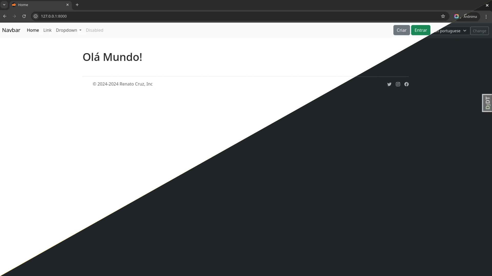

# Django

A ready-to-use starter template for building web applications with the [Django](https://www.djangoproject.com/) framework - structured, clean, and easy to extend.

## Done

- [x] [uv](https://github.com/astral-sh/uv). An extremely fast Python package and project manager, written in Rust.
- [x] [Django Rosetta](https://github.com/mbi/django-rosetta). Rosetta is a Django application that eases the translation process of your Django projects.
- [x] [Whitenoise](https://github.com/evansd/whitenoise). Radically simplified static file serving for Python web apps.
- [x] [Environs](https://github.com/sloria/environs). simplified environment variable parsing.
- [x] [Django Bootstrap 5](https://github.com/zostera/django-bootstrap5). Bootstrap 5 for Django.
- [x] [dj database url](https://github.com/jazzband/dj-database-url). Use Database URLs in your Django Application. 
- [x] [Gunicorn](https://github.com/benoitc/gunicorn). gunicorn 'Green Unicorn' is a WSGI HTTP Server for UNIX, fast clients and sleepy applications.
- [x] [Uvicorn](https://github.com/encode/uvicorn). An ASGI web server, for Python.
- [x] [Django debug toolbar](https://github.com/django-commons/django-debug-toolbar). A configurable set of panels that display various debug information about the current request/response.
- [x] [Ruff](https://github.com/astral-sh/ruff). An extremely fast Python linter and code formatter, written in Rust. 
- [x] [Taskipy](https://github.com/taskipy/taskipy). the complementary task runner for python 
- [x] Static files (dev).
- [x] Static urls.
- [x] I18n.
- [x] I18n JavaScript.
- [x] Change language.
- [x] Accounts urls.
- [x] Sitemaps.
- [x] light/dark mode.
