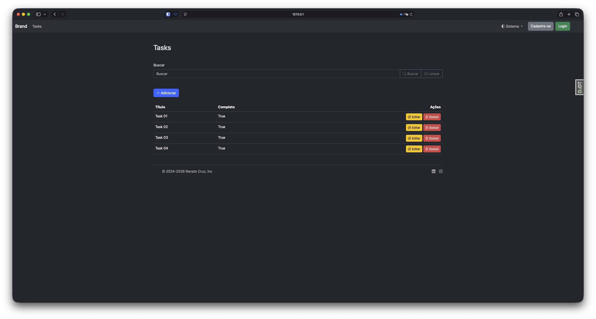

# py-django

Exemplo de projeto web com Python e o framework Django.

## Django

Principais comandos:

```bash
python manage.py startapp
python manage.py createsuperuser
python manage.py flush # Remove os dados e mantem as tabelas.
python manage.py reset_db # Exclui e recria o banco de dados.
python manage.py makemigrations --noinput
python manage.py migrate --noinput
python manage.py collectstatic --noinput
python manage.py runserver
```

> Alguns comandos permitem a utilização da flag `--noinput`.

## Uv

[Site oficial](https://github.com/astral-sh/uv).

### Formatar código

```bash
uv format
```

### Verificar atualizações:

```bash
uv tree --outdated --depth=1
uv lock --upgrade-package nome_do_pacote
uv sync
```

---

## Ruff

[Site oficial](https://github.com/astral-sh/ruff).

### Formatar código

```bash
uvx ruff check . --fix && uvx ruff format .
```

## Djangofmt

[Site oficial](https://github.com/UnknownPlatypus/djangofmt).

### Formatar os templates

```bash
uvx djangofmt .
```

---

## Caddy

[Site oficial](https://caddyserver.com).

1. Crie a estrutura de pastas

```bash
sudo mkdir -p /etc/caddy/sites-enabled
```

2. Mova o arquivo de configuração:

```bash
sudo cp _deploy/app_name.caddy /etc/caddy/sites-enabled/app_name.caddy
```

3. No arquivo `/etc/caddy/Caddyfile`, adicione só a linha de import:

```caddyfile
{
    email natorsc@gmail.com
}

import sites-enabled/*
```

Valide a configuração:

```bash
sudo caddy validate --config /etc/caddy/Caddyfile
```

Recarregue o serviço:

```bash
sudo systemctl reload caddy
```

---

## SystemD

[Site oficial]().

```bash
sudo cp _deploy/app_name.service /etc/systemd/system/app_name.service
```

```bash
sudo systemctl daemon-reload
sudo systemctl enable app_name.service # inicia junto com o boot do servidor.
sudo systemctl start app_name.service
sudo systemctl status app_name.service # confirma se subiu certo.
```

Para acompanhar logs:

```bash
sudo journalctl -u app_name.service -f # Em tempo real.
sudo journalctl -u app_name.service -n 200 # Ultimas 200 linhas.
sudo journalctl -u cimed-tools -p err # Somente os erros.
journalctl -u cimed-tools --since "1 hour ago" # Período específico.
```

---

## https desenvolvimento local

### mkcert

[Site oficial](https://github.com/filosottile/mkcert).

#### Como utilizar

```bash
mkcert -install
```

```bash
mkcert localhost 127.0.0.1 ::1
```

```bash
uvicorn _config.asgi:application --host 0.0.0.0 --port 8000 --ssl-keyfile certs/localhost-key.pem --ssl-certfile certs/localhost.pem
```

---


## Fixture

Exportar dados:

```bash
python -Xutf8 manage.py dumpdata app_name.model_name --output=app_name/fixtures/file_name.json
```

Importar dados:

```bash
python -Xutf8 manage.py loaddata file_name.json
```
